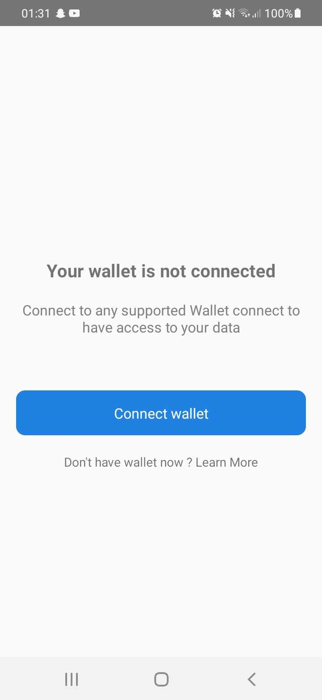
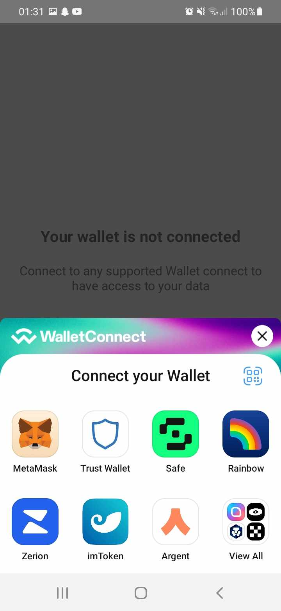
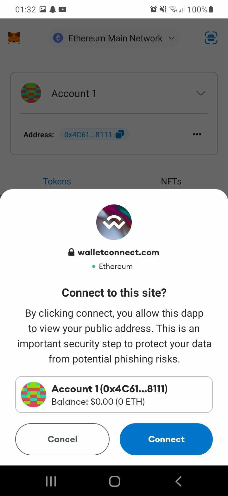
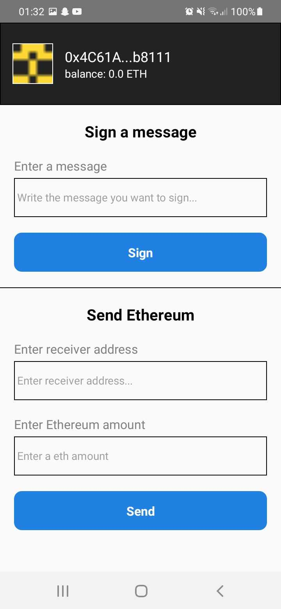

# React Native dApp with WalletConnect Integration

Welcome to the README of the React Native decentralized application (dApp) that utilizes the WalletConnect provider to establish connections with wallets and enables signing messages and transferring cryptocurrencies.

## Table of Contents

- [React Native dApp with WalletConnect Integration](#react-native-dapp-with-walletconnect-integration)
  - [Table of Contents](#table-of-contents)
  - [Introduction](#introduction)
  - [Features](#features)
  - [Prerequisites](#prerequisites)
  - [Installation](#installation)
  - [Switching Cryptocurrency Networks](#switching-cryptocurrency-networks)
  - [Screenshots](#screenshots)

## Introduction

This React Native dApp is designed to provide a seamless and secure way for users to interact with decentralized applications using their preferred wallets. The integration of the WalletConnect provider enables users to connect their wallets and perform actions like signing messages and transferring cryptocurrencies directly from within the app.

## Features

- Connect to a wide range of wallets using WalletConnect.
- Sign messages with the connected wallet's private key.
- Initiate cryptocurrency transfers securely.

## Prerequisites

Before you begin, ensure you have met the following requirements:

- Node.js and npm installed.
- React Native development environment set up.
- A basic understanding of React Native and Ethereum.

You'll also need to obtain a project ID from WalletConnect:

1. Visit [WalletConnect Cloud](https://cloud.walletconnect.com/).
2. Obtain your project ID from the WalletConnect Cloud dashboard.

Once you have your project ID:

1. Create a `.env` file in the root directory of your project.
2. Add the following line to your `.env` file, replacing `YOUR_WALLET_CONNECT_PROJECT_ID` with your actual project ID:
`WALLET_CONNECT_PROJECT_ID=YOUR_WALLET_CONNECT_PROJECT_ID`

## Installation

1. Clone this repository: `git clone https://github.com/your-username/your-react-native-dapp.git`

2. Navigate to the project directory: `cd your-react-native-dapp`

3. Install the dependencies: `npm install`

4. Open a new terminal window for running the Metro Bundler: `yarn start`

5. In another terminal window, run the app on your Android device/emulator: `yarn android`

6. Explore the app and interact with the wallet connection, message signing, and cryptocurrency transfer features.

## Switching Cryptocurrency Networks

If you'd like to change the cryptocurrency for a transfer within the app, you can do so by adjusting your wallet's network settings. Here's how you can achieve this:

1. Open your preferred wallet app.
2. Find the option to switch networks or chainIDs. This is usually located in the settings or network selection menu.
3. Select the desired cryptocurrency network. For example, you might switch from Ethereum Mainnet to a test network like Ropsten or a different blockchain altogether.
4. Confirm the network change in your wallet app.

After you've switched networks in your wallet, return to the app, and you'll notice that the title of the transfer will automatically update to reflect the name of the new network. This helps you easily identify which cryptocurrency network you are currently using.

## Screenshots

